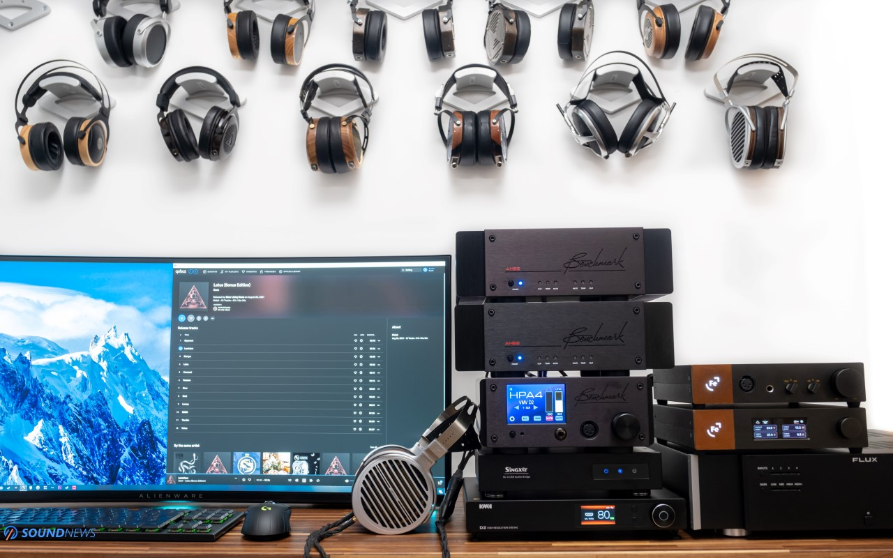
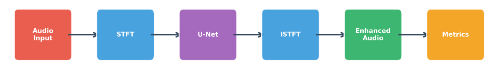
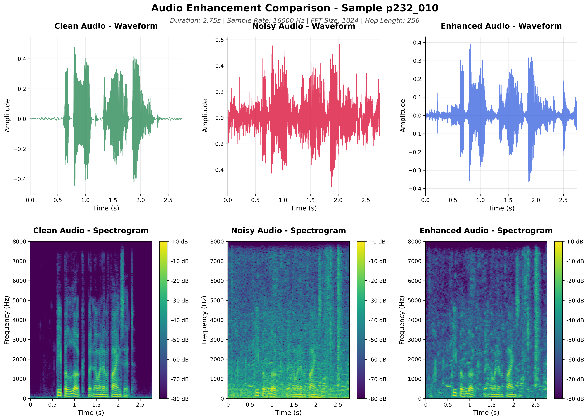

# Clear Voice

## U-Net speech enhancement system

<small>*AI-powered noise reduction for crystal clear audio*</small>

---

## **Team Members**

- **Radhey Kalra** 
- **Aabish Malik** 

---

## **Problem Statement**

### The Challenge
- Background noise degrades speech quality in recordings
- Manual noise removal is time-consuming and requires expertise
- Real-time enhancement needed for communication applications

### Current Pain Points
- Poor audio quality in noisy environments
- Complex professional software requirements
- Limited real-time processing capabilities

---

## **Solution Offered**

### AI-Powered Speech Enhancement
- **U-Net Architecture**: Deep learning model for noise reduction
- **Real-time Processing**: GPU-accelerated audio enhancement  
- **Multiple Interfaces**: Web app, CLI, and Jupyter notebook workflows
- **High Quality Output**: Professional-grade noise removal

### Key Features

- STFT-based spectral processing • Chunked audio handling for memory efficiency
- Interactive visualization tools • Multiple audio format support

---

## **Data Flow Diagram**

### Processing Pipeline
1. **Input** → Noisy audio file loaded via ffmpeg
2. **Preprocess** → STFT conversion to magnitude/phase spectrograms  
3. **Enhance** → U-Net model processes magnitude spectrogram
4. **Reconstruct** → ISTFT combines enhanced magnitude with original phase
5. **Output** → Clean audio saved in desired format

---

## **Technologies Used**

### Core Stack
- **PyTorch** | **CUDA** | **Python 3.13+** | **FFmpeg**

### Deep Learning & Audio Processing  
- **U-Net Architecture** - Encoder-decoder with skip connections | **Librosa** - Audio analysis | **NumPy** - Numerical computing

### Interface & Integration
- **Streamlit** - Web interface | **Jupyter** - Interactive development | **Matplotlib/Plotly** - Visualization

---

## **Outputs**

### Audio Comparison

**Noisy:**
<audio controls>
  <source src="../results/comparison/p232_010_noisy.wav" type="audio/wav">
</audio>

**Enhanced:**
<audio controls>
  <source src="../results/comparison/p232_010_enhanced.wav" type="audio/wav">
</audio>

**Clean:**
<audio controls>
  <source src="../results/comparison/p232_010_clean.wav" type="audio/wav">
</audio>

---

## **Demo**

---

## **Future Enhancements**

- Real-time streaming audio enhancement
- Multi-channel voice separation
- Mobile app development for iOS/Android
- Integration with video conferencing platforms

---

## **Q&A**

---

## **Thank You**
